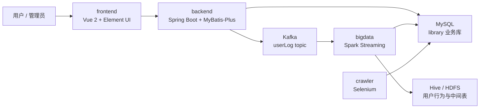
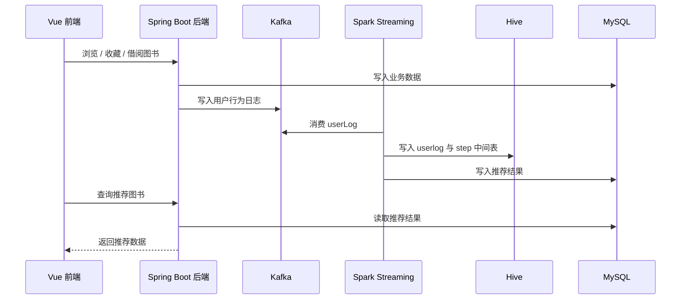

# BookRecommendation

图书推荐系统，本科毕业设计项目。项目以高校图书馆业务场景为背景，围绕学生用户、真实馆藏图书、借阅收藏行为和推荐计算，构建了一个前后端分离 + 大数据推荐链路的完整工程。

当前仓库已经整理为 monorepo，总体包含 Vue 前端、Spring Boot 后端、Spark/Hive/Kafka 推荐计算模块，以及用于补全图书封面的 Selenium 爬虫模块。

> 说明：本仓库不包含原始数据库数据。原始数据包含真实学生学号、学籍信息和图书馆馆藏数据，且项目完成多年后因电脑清理导致数据库文件遗失。当前仓库主要用于展示项目代码、架构设计和工程实现方式。

## 项目功能

- 用户注册、登录和权限认证
- 本校学生学号校验与用户身份绑定
- 图书检索、图书详情、馆藏状态展示
- 图书收藏、借阅和用户行为记录
- 后台用户、图书、借阅等业务管理
- Kafka 用户行为日志采集
- Spark + Hive 推荐计算
- 个性化推荐、相关图书推荐、新书推荐
- 图书封面缺失数据爬取与补全

## 技术栈

| 模块 | 技术 |
| --- | --- |
| 前端 | Vue 2、Vue Router、Vuex、Element UI、Axios、ECharts |
| 后端 | Spring Boot、Spring Security、MyBatis-Plus、MySQL、Druid、JWT、Knife4j/Swagger、Kafka |
| 大数据 | Spark、Spark Streaming、Spark SQL、Hive、Hadoop、Kafka |
| 爬虫 | Python、Selenium、PyMySQL、ChromeDriver |
| 数据库 | MySQL、Hive |
| 构建工具 | Maven、npm |

## 系统架构



完整系统不是单纯的 Windows 本地 Web 项目。前端、后端和爬虫可以在本地开发调试，但推荐计算链路需要 Linux/Ubuntu 环境中的 Hadoop、Hive、Spark 和 Kafka 支撑。

## 目录结构

```text
BookRecommendation/
├── backend/      # Spring Boot 后端服务
├── bigdata/      # Spark / Hive / Kafka 推荐计算模块
├── crawler/      # 图书封面补全爬虫
├── database/     # 数据库脚本占位目录，后续可补充脱敏 SQL
├── docs/         # 项目详细文档
├── frontend/     # Vue 前端项目
├── scripts/      # 辅助脚本占位目录
├── .gitignore
└── README.md
```

`database/` 与 `scripts/` 当前仅作为本地预留目录，因 Git 不提交空目录，首次上传时不会出现在 GitHub 仓库中；后续补充脱敏 SQL 或辅助脚本时再创建对应目录内容。

## 核心数据链路

用户在前端浏览、收藏或借阅图书时，后端会写入业务数据，并将行为日志发送到 Kafka。大数据模块消费 Kafka 中的用户行为，写入 Hive 中间表，经 Spark 计算后将推荐结果回写到 MySQL，最终由后端接口提供给前端展示。



## 数据库与隐私说明

毕业设计时期的原始数据库包含学校真实学生学号、姓名、学院班级等学籍信息，也包含图书馆真实馆藏图书和借阅行为数据。出于隐私原因，这类数据不应直接公开。

当前仓库不包含原始数据库，原因包括：

- 原始数据包含真实学生信息和真实图书馆业务数据。
- 项目完成至今已约三年，后续因工作使用电脑并清理数据，原始数据库文件已经遗失。
- 若要公开演示，应重新构造脱敏数据或虚拟样例数据。

代码中登录认证使用 `user.account`，学生身份绑定和推荐链路主要使用 `user.certId` / `reader.CERT_ID`。本校学生通过真实学号完成身份校验，后续浏览、收藏、借阅等行为也以 `certId` 作为推荐计算中的用户标识。

更多说明见 [数据库说明](./docs/database.md) 和 [项目背景与数据说明](./docs/project-background.md)。

## 部署说明

### 1. 前端

```bash
cd frontend
npm install
npm run serve
```

前端默认请求后端地址：

```text
http://localhost:8081/book_recommendation
```

配置位置：

```text
frontend/src/main.js
```

### 2. 后端

```bash
cd backend
mvn spring-boot:run
```

后端依赖 MySQL 业务库和 Kafka。历史开发配置中，MySQL 指向 `hadoopPD:3306/library`，Kafka 指向 `192.168.10.12:9092`。迁移到新环境时需要按实际机器地址调整配置。

主要配置文件：

```text
backend/src/main/resources/application-dev.yml
backend/src/main/resources/application.yml
```

### 3. 大数据推荐模块

`bigdata` 模块需要在 Linux/Ubuntu 大数据环境中运行，依赖：

- Hadoop / HDFS
- Hive
- Spark
- Kafka
- MySQL

该模块负责消费 Kafka 用户行为、写入 Hive、执行推荐计算，并将结果回写到 MySQL。

详细说明见 [Linux 与大数据部署说明](./docs/deployment-linux.md)。

### 4. 爬虫模块

```bash
cd crawler
python main.py
```

爬虫用于读取 `book` 表中缺失封面的图书，根据书名搜索外部图书页面，并回写 `book.img` 字段。

详细说明见 [爬虫子项目说明](./docs/crawler.md)。

## 推荐算法简述

系统将用户行为划分为浏览、收藏、借阅，并为不同行为设置不同权重：

| 行为 | 权重 |
| --- | --- |
| 浏览图书 | 0.15 |
| 收藏图书 | 0.25 |
| 借阅图书 | 0.60 |

在图书相似度计算阶段，系统采用基于物品的协同过滤思路：先根据用户行为权重构建用户-图书偏好矩阵，再在两本图书的用户并集上构造 0/1 行为向量，并按 Pearson 相关系数公式计算图书之间的相似度。为符合推荐场景，推荐矩阵只保留正相关图书对，避免负相关关系参与推荐分数累加。

Spark 任务会基于用户-图书行为权重构建推荐计算链路，生成用户个性化推荐、相关图书推荐和新书推荐。完整过程见 [推荐算法与数据链路](./docs/recommendation-algorithm.md)。

## 项目亮点

- 不是单一 CRUD 项目，而是包含前端、后端、大数据、爬虫的完整工程链路。
- 使用 Kafka 解耦用户行为采集和推荐计算，避免推荐逻辑阻塞业务接口。
- 使用 Spark Streaming 消费用户行为日志，并通过 Hive 分区表沉淀中间计算结果。
- 在大数据模块中实现基于物品的协同过滤推荐链路，通过 Spark/Hive 分步构建用户偏好矩阵、图书相似度矩阵和最终推荐结果。
- 后端接入 Spring Security、JWT 和 BCrypt，实现无状态登录认证与密码加密。
- 使用 Knife4j / Swagger 生成接口文档，提升前后端联调和接口管理效率。
- 前端结合 ECharts 展示系统统计图表，补充图书推荐系统的数据可视化能力。
- 结合真实图书馆业务数据场景，考虑了学生身份、借阅行为、图书封面缺失等实际问题。
- 对历史项目的数据缺失和隐私限制进行了明确说明，便于后续脱敏重建。

## 文档导航

- [项目背景与数据说明](./docs/project-background.md)
- [总体架构](./docs/architecture.md)
- [数据库说明](./docs/database.md)
- [Linux 与大数据部署说明](./docs/deployment-linux.md)
- [推荐算法与数据链路](./docs/recommendation-algorithm.md)
- [爬虫子项目说明](./docs/crawler.md)

## 后续可改进方向

- 补充脱敏后的 MySQL 建表 SQL 和少量演示数据。
- 增加 `.env.example`，减少环境地址写死带来的迁移成本。
- 补充前端页面截图和推荐链路运行截图。
- 将后端、前端和大数据模块的启动方式整理为更清晰的部署脚本。
- 为核心业务接口和推荐计算增加更完整的测试说明。
