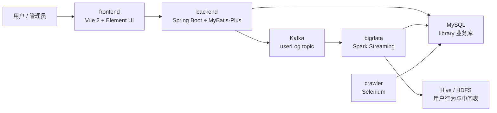
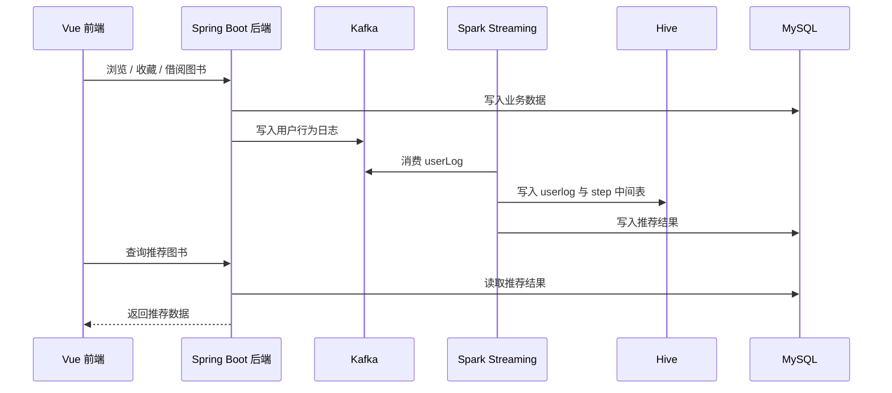
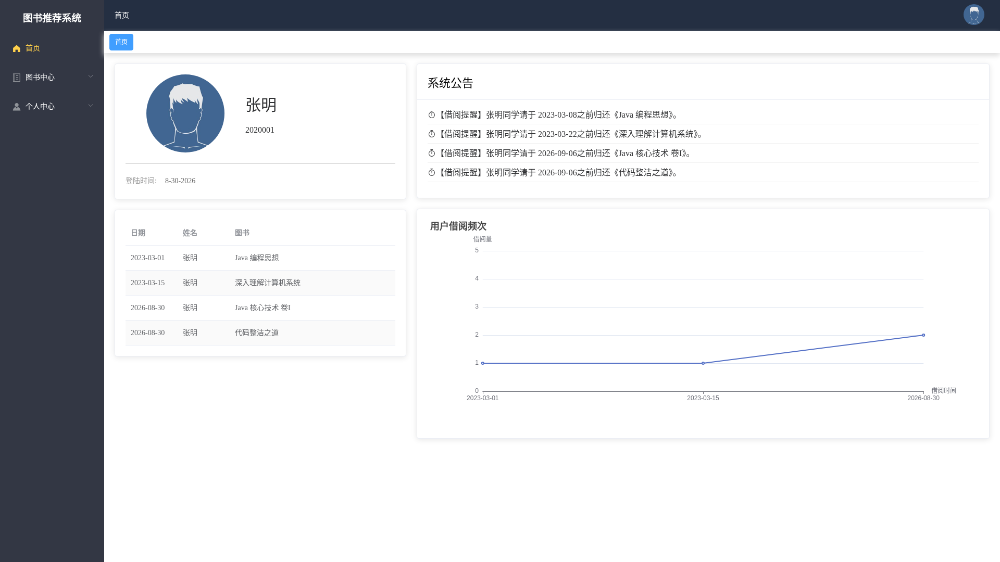
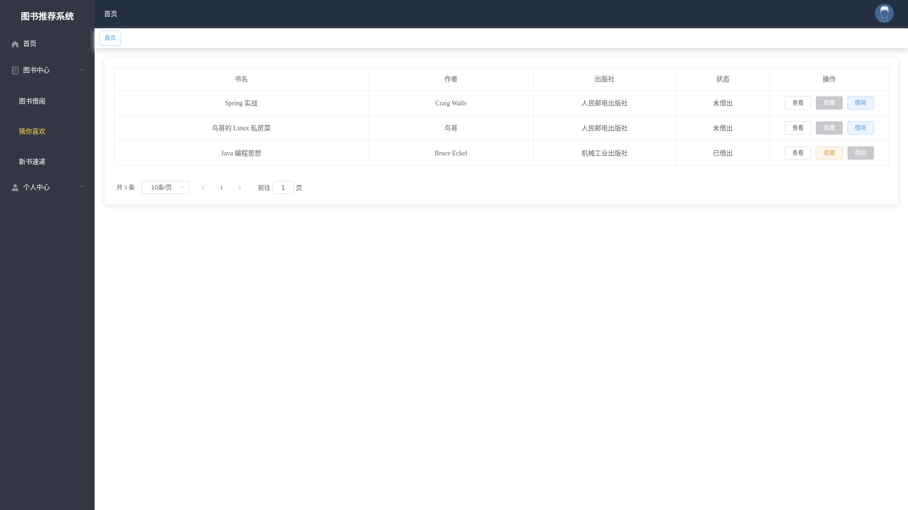
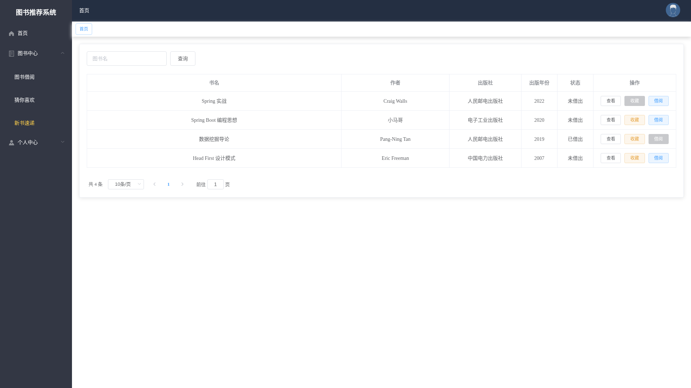
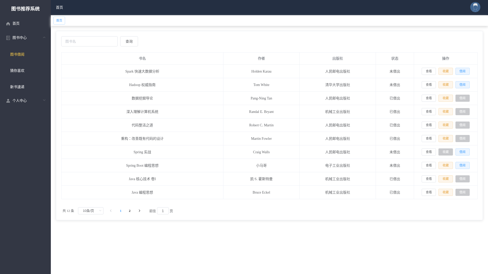
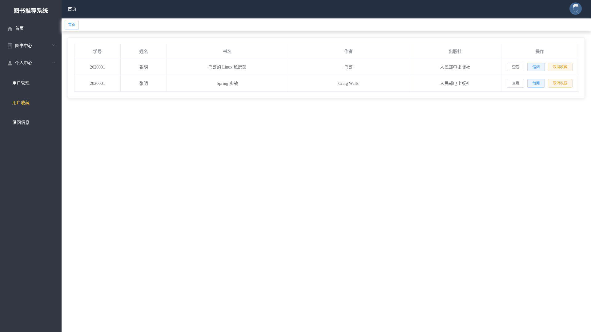

<p align="center">
  
</p>

<h1 align="center">BookRecommendation</h1>

<p align="center">高校图书馆业务场景下的图书推荐系统，覆盖学生用户、馆藏图书、借阅行为和 Spark / Hive 推荐计算链路。</p>

<p align="center">
  <a href="./README.md">简体中文</a> | <a href="./README.en.md">English</a>
</p>

<p align="center">
  
  
  
  <a href="./LICENSE"></a>
</p>

<p align="center">
  
</p>

图书推荐系统，本科毕业设计项目。项目以高校图书馆业务场景为背景，围绕学生用户、真实馆藏图书、借阅收藏行为和推荐计算，构建了一个前后端分离 + 大数据推荐链路的完整工程。

当前仓库已经整理为 monorepo，总体包含 Vue 前端、Spring Boot 后端、Spark/Hive/Kafka 推荐计算模块，以及用于补全图书封面的 Selenium 爬虫模块。

> 说明：本仓库不包含原始数据库数据。原始数据包含真实学生学号、学籍信息和图书馆馆藏数据，且项目完成多年后因电脑清理导致数据库文件遗失。当前仓库主要用于展示项目代码、架构设计和工程实现方式。

## 项目功能

- 用户注册、登录和权限认证
- 本校学生学号校验与用户身份绑定
- 图书检索、图书详情、馆藏状态展示
- 图书收藏、借阅和用户行为记录
- 后台用户、图书、借阅等业务管理
- Kafka 用户行为日志采集
- Spark + Hive 推荐计算
- 个性化推荐、相关图书推荐、新书推荐
- 图书封面缺失数据爬取与补全

## 技术栈

| 模块 | 技术 |
| --- | --- |
| 前端 | Vue 2、Vue Router、Vuex、Element UI、Axios、ECharts |
| 后端 | Spring Boot、Spring Security、MyBatis-Plus、MySQL、Druid、JWT、Knife4j/Swagger、Kafka |
| 大数据 | Spark、Spark Streaming、Spark SQL、Hive、Hadoop、Kafka |
| 爬虫 | Python、Selenium、PyMySQL、ChromeDriver |
| 数据库 | MySQL、Hive |
| 构建工具 | Maven、npm |

## 系统架构


```mermaid
flowchart LR
    User["用户 / 管理员"] --> Frontend["frontend\nVue 2 + Element UI"]
    Frontend --> Backend["backend\nSpring Boot + MyBatis-Plus"]
    Backend --> MySQL["MySQL\nlibrary 业务库"]
    Backend --> Kafka["Kafka\nuserLog topic"]
    Kafka --> Spark["bigdata\nSpark Streaming"]
    Spark --> Hive["Hive / HDFS\n用户行为与中间表"]
    Spark --> MySQL
    Crawler["crawler\nSelenium"] --> MySQL
```

完整系统包含前端、后端和大数据推荐链路。**已在本机 Windows 单机完整验证**：Kafka（KRaft）+ Spark 3.5.2 + 真实 Hive 4.0（metastore 元数据存 MySQL）+ MySQL 全部原生运行，Spark Streaming 消费用户行为、Hive 沉淀中间表、推荐结果回写 MySQL 全链路可用（一键脚本见下文）。

## 目录结构

```text
BookRecommendation/
├── backend/      # Spring Boot 后端服务
├── bigdata/      # Spark / Hive / Kafka 推荐计算模块
├── crawler/      # 图书封面补全爬虫
├── database/     # 数据库脚本（init.sql：建库建表 + 演示数据 + 预置推荐）
├── docs/         # 项目详细文档
├── frontend/     # Vue 前端项目
├── scripts/      # 一键启停脚本（start-book.ps1 / stop-book.ps1）
├── .env.example  # 环境变量示例（后端/前端/大数据配置外置清单）
├── .gitignore
└── README.md
```

`database/init.sql` 提供完整建库建表与演示数据；`scripts/` 提供一键启停脚本（见上文"一键启动/停止"）。

## 核心数据链路

用户在前端浏览、收藏或借阅图书时，后端会写入业务数据，并将行为日志发送到 Kafka。大数据模块消费 Kafka 中的用户行为，写入 Hive 中间表，经 Spark 计算后将推荐结果回写到 MySQL，最终由后端接口提供给前端展示。


```mermaid
sequenceDiagram
    participant F as Vue 前端
    participant B as Spring Boot 后端
    participant K as Kafka
    participant S as Spark Streaming
    participant H as Hive
    participant M as MySQL

    F->>B: 浏览 / 收藏 / 借阅图书
    B->>M: 写入业务数据
    B->>K: 写入用户行为日志
    S->>K: 消费 userLog
    S->>H: 写入 userlog 与 step 中间表
    S->>M: 写入推荐结果
    F->>B: 查询推荐图书
    B->>M: 读取推荐结果
    B-->>F: 返回推荐数据
```

## 数据库与隐私说明

毕业设计时期的原始数据库包含学校真实学生学号、姓名、学院班级等学籍信息，也包含图书馆真实馆藏图书和借阅行为数据。出于隐私原因，这类数据不应直接公开。

当前仓库不包含原始数据库，原因包括：

- 原始数据包含真实学生信息和真实图书馆业务数据。
- 项目完成至今已约三年，后续因工作使用电脑并清理数据，原始数据库文件已经遗失。
- 若要公开演示，应重新构造脱敏数据或虚拟样例数据。

代码中登录认证使用 `user.account`，学生身份绑定和推荐链路主要使用 `user.certId` / `reader.CERT_ID`。本校学生通过真实学号完成身份校验，后续浏览、收藏、借阅等行为也以 `certId` 作为推荐计算中的用户标识。

更多说明见 [数据库说明](./docs/database.md) 和 [项目背景与数据说明](./docs/project-background.md)。

## 本地运行（Windows 单机）

推荐结果已由 `database/init.sql` 预置，不依赖 Hadoop/Kafka/Spark/Hive 即可完整演示推荐功能：

```bash
mysql -uroot -proot < database/init.sql   # 建库建表 + 演示数据 + 预置推荐
cd backend && mvnw.cmd spring-boot:run     # 后端 (8081)
cd frontend && npm install && npm run serve # 前端
```

演示账号 `2020001` / `2020002` / `2020003`，密码 `123456`。

### 一键启动 / 停止（含大数据全链路）

仓库提供 PowerShell 一键脚本，按顺序启动 **MySQL → Kafka → Hive metastore → 后端 → Spark Streaming → 前端**（幂等，已运行的服务自动跳过）：

```powershell
powershell -ExecutionPolicy Bypass -File scripts\start-book.ps1
powershell -ExecutionPolicy Bypass -File scripts\stop-book.ps1
```

日志输出到仓库 `logs/` 目录。大数据全链路（Kafka 行为日志 → Spark Streaming → 真实 Hive 4.0 元数据（MySQL 存储）→ 推荐结果回写 MySQL）在本机已完整验证（推荐 12 条结果正常产出）。环境与软件要求见 [本地完整运行指南](./docs/running-local.md)。

### Docker 部署（可选）

仓库提供完整 Docker Compose 编排（Spark 3.5.2 [Scala 2.13 官方镜像] + Kafka 3.7 + MySQL 8 + 前后端，Hive 表经内嵌 derby 落命名卷），适合服务器部署。详见 [Docker 全链路部署指南](./docs/docker-deploy.md)；本机（WSL2 + Docker Desktop）验证 Docker 编排的逐步操作见 [WSL + Docker 全链路验证指南](./docs/wsl-docker-verify.md)。

### 免费在线演示（无需服务器）✅ 已上线

项目支持"预置推荐模式"（推荐结果由 `database/init.sql` 预置，Kafka 懒初始化、broker 不可达时后端照常启动），已用**免费托管**部署到公网，可直接作为作品集/简历的在线体验入口：

- **在线体验**：https://white-147.github.io/BookRecommendation/ （测试账号 `2020001 / 123456`）
- 前端：**GitHub Pages**（push 自动构建部署）
- 后端：**Render Free**（Docker，`https://book-recommendation-9542.onrender.com`，免费 750 小时/月）
- 数据库：**TiDB Cloud Serverless**（MySQL 兼容，免费 5GB，代码零改动）

大数据实时链路（Kafka/Spark/Hive）在免费层不运行，演示的是预置推荐模式（浏览/搜索/收藏/借阅/推荐展示全功能）。部署步骤与踩坑记录（openjdk 镜像下架、Druid 环境变量前缀、连接池限制、publicPath、Health Check 等）见 [免费在线部署指南](./docs/deploy-free.md)。

## 已实跑验证（Docker 全链路）✅

2026-08 在本机 **Windows + WSL2 + Docker Desktop 4.88.1** 上把 Docker 编排完整跑通，并验证推荐链路**真实产出**（非仅使用 `init.sql` 预置数据）：

- **环境**：自建 amd64 Spark 3.5.2（Scala 2.13，`bigdata/Dockerfile`，基于官方 `spark-3.5.2-bin-hadoop3-scala2.13` 二进制包）+ Kafka 3.7（KRaft，`bitnamilegacy/kafka`）+ MySQL 8 + 前后端容器。
- **验证结果**：

| 环节 | 结果 |
| --- | --- |
| Kafka 消费 | 前端浏览/收藏/借阅行为 → `userLog` topic，Spark Streaming 每分钟批次消费 |
| Hive 中间表 | `userlog` 7 条行为落表；`step1~step8` 全部产出（内嵌 derby metastore，数据落命名卷） |
| 图书相似度（step5） | **15 条正相关图书对**（全用户空间皮尔逊，含 (0,0) 样本点，系数 1.0） |
| 推荐回写（step8） | `recommend` 表被计算结果覆盖：2020001 → Java 编程思想 0.625 / Spring 实战 0.5 / 鸟哥的 Linux 私房菜 0.375 |
| 相关图书回写 | `relatedbook` 15 条（RelatedBookRecommend） |
| 前端展示 | "猜你喜欢"页显示 3 条链路推荐；首页 ECharts 借阅频次图正常渲染 |

实跑截图（`docs/assets/screenshots/`）：

| 登录页 | 首页（用户卡片 + 借阅提醒 + ECharts） |
| --- | --- |
|  |  |

| 猜你喜欢（链路推荐） | 新书速递 | 图书借阅 | 我的收藏 |
| --- | --- | --- | --- |
|  |  |  |  |

**复现**：`docker compose up -d --build mysql kafka bigdata` → `docker compose up -d backend frontend` → 容器内 `spark-submit` 启动 `SparkStreamingRunner`（完整步骤见 [WSL + Docker 全链路验证指南](./docs/wsl-docker-verify.md)）→ 前端登录 `2020001/123456` 操作图书 → 查看 `recommend` / `step5`。

> 截图由仓库自带工具生成：`scripts/screenshots/`（容器内 puppeteer，`docker build -t book-shots scripts\screenshots` 后 `docker run` 即可复现）。

## 部署说明

### 1. 前端

```bash
cd frontend
npm install
npm run serve
```

前端默认请求后端地址：

```text
http://localhost:8081/book_recommendation
```

配置位置：

```text
frontend/src/main.js
```

### 2. 后端

```bash
cd backend
mvn spring-boot:run
```

后端依赖 MySQL 业务库和 Kafka。历史开发配置中，MySQL 指向 `hadoopPD:3306/library`，Kafka 指向 `192.168.10.12:9092`。迁移到新环境时需要按实际机器地址调整配置。

主要配置文件：

```text
backend/src/main/resources/application-dev.yml
backend/src/main/resources/application.yml
```

配置外置：仓库根目录 `.env.example` 列出全部可覆盖的环境变量（数据库连接、连接池、Kafka 地址、前端 API 基址）。后端已内置本机默认值（`localhost:3306` / `root:root` / `localhost:9092`），无需任何配置即可本地运行；需要覆盖时设置同名环境变量（如 `SPRING_DATASOURCE_DRUID_PASSWORD`、`SPRING_KAFKA_BOOTSTRAP_SERVERS`）。

### 3. 大数据推荐模块

`bigdata` 模块负责消费 Kafka 用户行为、写入 Hive、执行推荐计算，并将结果回写到 MySQL。依赖 Hadoop（winutils 兼容层）/ Hive（metastore）/ Spark / Kafka / MySQL。

本机 Windows 原生运行方式见 [本地完整运行指南](./docs/running-local.md)；Linux/Ubuntu 集群部署见 [Linux 与大数据部署说明](./docs/deployment-linux.md)；Docker 一键编排见 [Docker 全链路部署指南](./docs/docker-deploy.md)。

### 4. 爬虫模块

```bash
cd crawler
python main.py
```

爬虫用于读取 `book` 表中缺失封面的图书，根据书名搜索外部图书页面，并回写 `book.img` 字段。

详细说明见 [爬虫子项目说明](./docs/crawler.md)。

## 推荐算法简述

系统将用户行为划分为浏览、收藏、借阅，并为不同行为设置不同权重：

| 行为 | 权重 |
| --- | --- |
| 浏览图书 | 0.15 |
| 收藏图书 | 0.25 |
| 借阅图书 | 0.60 |

在图书相似度计算阶段，系统采用基于物品的协同过滤思路：先根据用户行为权重构建用户-图书偏好矩阵，再在两本图书的用户并集上构造 0/1 行为向量，并按 Pearson 相关系数公式计算图书之间的相似度。为符合推荐场景，推荐矩阵只保留正相关图书对，避免负相关关系参与推荐分数累加。

Spark 任务会基于用户-图书行为权重构建推荐计算链路，生成用户个性化推荐、相关图书推荐和新书推荐。完整过程见 [推荐算法与数据链路](./docs/recommendation-algorithm.md)。

## 项目亮点

- 不是单一 CRUD 项目，而是包含前端、后端、大数据、爬虫的完整工程链路。
- 使用 Kafka 解耦用户行为采集和推荐计算，避免推荐逻辑阻塞业务接口。
- 使用 Spark Streaming 消费用户行为日志，并通过 Hive 分区表沉淀中间计算结果。
- 在大数据模块中实现基于物品的协同过滤推荐链路，通过 Spark/Hive 分步构建用户偏好矩阵、图书相似度矩阵和最终推荐结果。
- 后端接入 Spring Security、JWT 和 BCrypt，实现无状态登录认证与密码加密。
- 使用 Knife4j / Swagger 生成接口文档，提升前后端联调和接口管理效率。
- 前端结合 ECharts 展示系统统计图表，补充图书推荐系统的数据可视化能力。
- 结合真实图书馆业务数据场景，考虑了学生身份、借阅行为、图书封面缺失等实际问题。
- 对历史项目的数据缺失和隐私限制进行了明确说明，便于后续脱敏重建。

## 文档导航

- [项目背景与数据说明](./docs/project-background.md)
- [总体架构](./docs/architecture.md)
- [数据库说明](./docs/database.md)
- [本地完整运行指南（Windows，含一键脚本）](./docs/running-local.md)
- [免费在线部署指南（Render + TiDB + GitHub Pages）](./docs/deploy-free.md)
- [Docker 全链路部署指南](./docs/docker-deploy.md)
- [WSL + Docker 全链路验证指南（本机验证 Docker 编排）](./docs/wsl-docker-verify.md)
- [Linux 与大数据部署说明](./docs/deployment-linux.md)
- [推荐算法与数据链路](./docs/recommendation-algorithm.md)
- [爬虫子项目说明](./docs/crawler.md)

## 后续可改进方向

- ✅ 已补充根目录 `.env.example` 与配置外置（数据库 / 连接池 / Kafka / 前端 API 均支持环境变量覆盖，代码默认值即本机地址）。
- ✅ 已为推荐算法核心函数（Step5 皮尔逊相关系数 / parseUsers）补充 ScalaTest 单测（`bigdata/src/test/scala/com/hytc/bigdata/Step5Test.scala`）。
- ✅ 已将 Step5 皮尔逊相似度改为**全用户空间**计算（0/1 向量含"双方均未操作"的 (0,0) 样本点，用户集完全相同视为 1.0），修复原"用户并集"构造使系数恒 ≤ 0、推荐链路产出为空的缺陷；单测覆盖正/负相关与边界。
- ✅ 已将 Step8 / NewBookRecommend / RelatedBookRecommend 的 JDBC 回写地址外置为 `com.hytc.util.JdbcConfig`（优先级：环境变量 `BOOK_DB_*` > `config.properties` 的 `db.*` > 本机默认值），并新增 `JdbcConfigTest`；docker-compose 已注入容器内回写地址。
- ✅ 已修复 docker-compose 链路：backend 镜像改用 eclipse-temurin（openjdk/maven 官方镜像已下架）；compose 数据库环境变量改用 Druid 前缀 `SPRING_DATASOURCE_DRUID_*`；前端新增 docker 构建模式（相对路径经 nginx 代理本机后端，不再依赖 Render 在线后端）。
- ✅ 已补充实跑截图（登录 / 首页 ECharts / 猜你喜欢 / 新书速递 / 图书借阅 / 我的收藏，见「已实跑验证（Docker 全链路）」章节，由 `scripts/screenshots` 工具生成）。
- 将图书封面资源补齐为正式封面图（当前使用占位图）。
- ✅ 已在本机（WSL2 + Docker Desktop）实跑 Docker 全链路并验证推荐产出（见「已实跑验证（Docker 全链路）」章节）。
