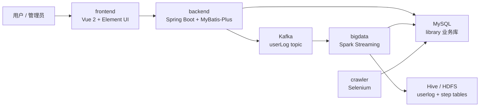
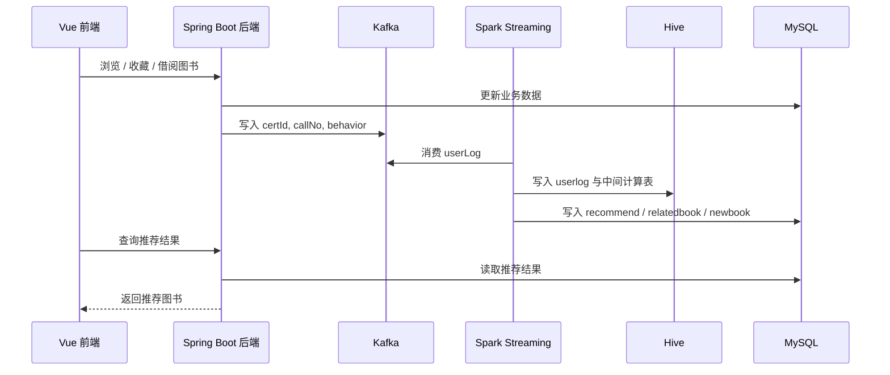

# 总体架构

本项目整理为 monorepo 后，可以按功能划分为四个主要子系统：前端、后端、大数据计算和爬虫辅助工具。完整运行还依赖 MySQL、Kafka、Hadoop、Hive、Spark 等外部服务。

## 模块划分

| 目录 | 模块 | 主要职责 |
| --- | --- | --- |
| `frontend` | Vue 前端 | 登录注册、图书检索、图书详情、借阅收藏、推荐展示、后台管理页面 |
| `backend` | Spring Boot 后端 | 业务接口、权限认证、MySQL 访问、用户行为写入 Kafka |
| `bigdata` | Spark/Hive 推荐计算 | 消费 Kafka 用户行为，写入 Hive，计算推荐结果并回写 MySQL |
| `crawler` | Selenium 爬虫 | 从外部网站补全图书封面 URL，回写 `book.img` 字段 |
| `database` | 数据库占位目录 | 后续可放置脱敏 SQL、表结构或演示数据 |
| `docs` | 文档目录 | 项目背景、架构、部署、数据库和算法说明 |

## 跨系统运行关系

完整系统并不只是 Windows 本地 Web 项目。业务前后端可以在 Windows 开发环境中调试，但推荐计算链路依赖 Linux/Ubuntu 上的 Hadoop 生态环境。

## 业务数据链路

用户在前端进行浏览、收藏、借阅等操作后，后端会执行业务写库，并把关键行为写入 Kafka：

## 关键配置位置

| 模块 | 配置文件 | 说明 |
| --- | --- | --- |
| `frontend` | `src/main.js` | Axios 默认后端地址为 `http://localhost:8081/book_recommendation` |
| `backend` | `src/main/resources/application-dev.yml` | MySQL 业务库地址、端口、context-path |
| `backend` | `src/main/resources/application.yml` | Kafka 地址等通用配置 |
| `bigdata` | `src/main/resources/config.properties` | Kafka broker 配置 |
| `bigdata` | `src/main/resources/hive-site.xml` | Hive metastore 数据库连接 |
| `crawler` | `main.py` | MySQL 连接、ChromeDriver 路径、目标网站搜索逻辑 |

## 完整运行依赖

完整运行需要至少具备以下环境：

- Windows 或本地开发环境：前端、后端、爬虫可在本地开发调试。
- Linux/Ubuntu 大数据环境：Hadoop、Hive、Spark、Kafka 推荐链路需要在该环境中运行。
- MySQL：承载 `library` 业务库，也可承载 Hive metastore。
- Kafka：承载用户行为日志 topic。
- JDK、Maven、Node.js、Python、ChromeDriver 等语言和工具链。

其中 `bigdata` 模块对 Hadoop/Hive/Spark/Kafka 的依赖无法仅通过代码体现，需要在 README 和部署文档中明确说明。
