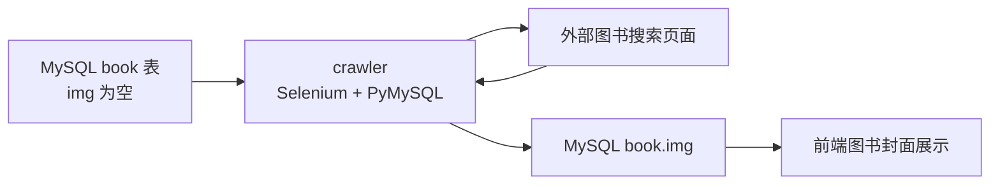

# 爬虫子项目说明

`crawler` 子项目用于补全图书馆馆藏数据中缺失的图书封面信息。它不是独立产品，而是主图书推荐系统的数据清洗和数据补全工具。

## 使用场景

原始图书馆数据中包含真实图书信息，但部分图书存在封面缺失或信息不完整的情况。前端图书列表和详情页需要封面展示，因此需要额外补充 `book.img` 字段。

爬虫的工作流程是：

1. 连接 MySQL `library` 数据库。
2. 查询 `book` 表中 `img is null` 的图书标题。
3. 使用 Selenium 打开当当网。
4. 按书名搜索图书。
5. 提取搜索结果中的图书图片 URL。
6. 回写到 `book.img` 字段。
7. 如果未找到结果，则写入 `not found` 标记。

## 技术栈

| 类型 | 技术 |
| --- | --- |
| 语言 | Python |
| 浏览器自动化 | Selenium |
| 数据库访问 | PyMySQL |
| 浏览器驱动 | ChromeDriver |
| 目标数据库 | MySQL `library` |

## 与主系统的关系



补全封面后，前端和后端无需感知爬虫过程，只需要读取 `book.img` 字段即可展示图书封面。

## 当前代码中的历史配置

爬虫中保留了毕业设计时期的数据库连接配置，例如：

```text
host = 192.168.10.12
database = library
```

同时代码使用本地 `./tool/chromedriver.exe`。当前仓库 `.gitignore` 已忽略 `crawler/tool/`，避免把本地浏览器驱动提交到 GitHub。

## 运行前提

要运行爬虫，需要准备：

- 可访问的 MySQL `library` 数据库。
- 已存在的 `book` 表。
- `book` 表中存在 `M_TITLE` 和 `img` 字段。
- 本地已安装 Chrome。
- ChromeDriver 版本与 Chrome 版本匹配。
- Python 环境中安装 Selenium 和 PyMySQL。

## 注意事项

- 当前爬虫依赖外部网站页面结构，目标网站结构变化可能导致选择器失效。
- 抓取外部图片 URL 可能受目标网站访问策略影响。
- 如果要长期维护，建议增加请求失败重试、日志记录、限速和结果校验。
- 如果用于公开演示，建议改用少量脱敏图书数据和可控图片资源。

## README 中的推荐表述

在根目录 README 中可以把该模块描述为：

> 爬虫模块用于对图书馆原始馆藏数据进行辅助补全，主要根据缺失封面的图书标题搜索外部图书页面，并将封面图片 URL 回写至业务库，改善前端图书展示效果。
