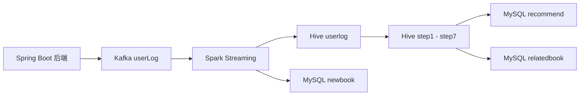

# 推荐算法与数据链路

本项目的推荐链路以用户行为为核心。后端在用户浏览、收藏、借阅图书时，把行为写入 Kafka；大数据模块消费这些行为，通过 Spark 和 Hive 生成推荐结果，最终回写 MySQL 供业务系统查询。

## 行为采集

后端会在关键业务接口中写入用户行为：

| 行为 | 含义 | 权重 |
| --- | --- | --- |
| `consultBook` | 浏览图书详情 | 0.15 |
| `addCollect` | 收藏图书 | 0.25 |
| `addLend` | 借阅图书 | 0.60 |

行为消息的核心字段为：

```text
certId, callNo, behavior
```

其中：

- `certId` 表示用户身份标识，学生用户对应真实学号。
- `callNo` 表示图书编号。
- `behavior` 表示用户行为类型。

## 数据流向



## 计算步骤

从 `bigdata` 模块代码可以看出，推荐计算被拆成多个 step：

| 步骤 | 作用 |
| --- | --- |
| `userlog` | 保存 Kafka 中消费到的原始用户行为 |
| `step1` | 按用户和图书聚合行为权重 |
| `step2` | 构建用户-图书行为向量中间结果 |
| `step3` | 构建图书关联或共现计算中间结果 |
| `step4` | 进一步计算关联分数 |
| `step5` | 基于用户并集构造图书 0/1 行为向量，并按 Pearson 相关系数公式计算图书相似度 |
| `step6` | 生成用户候选推荐结果 |
| `step7` | 对候选推荐结果进行排序或筛选 |
| `step8` | 结合已借阅记录过滤，并写入 MySQL 推荐结果 |

整体思路是通过用户对图书的行为强度构建偏好，再计算图书之间的相似关系，最后为用户生成推荐结果。

## 图书相似度计算

`step5` 使用 Pearson 相关系数计算图书之间的相似度。系统会先取两本图书发生过行为的用户并集，再分别构造两本图书在该用户集合上的 0/1 行为向量：

- 用户对图书产生过浏览、收藏或借阅行为，向量值为 `1`
- 用户未对图书产生行为，向量值为 `0`

随后按 Pearson 相关系数公式计算相似度：

```text
r = sum((x_i - mean(x)) * (y_i - mean(y)))
    / sqrt(sum((x_i - mean(x))^2) * sum((y_i - mean(y))^2))
```

其中 `x` 和 `y` 分别表示两本图书在同一用户集合上的行为向量。当分母为 0 或计算结果非法时，系统将相似度置为 0。由于推荐场景关注相似图书，后续只保留正相关结果进入 `step6` 和 `step7`，避免负相关关系参与推荐分数累加。

## 推荐结果

推荐结果会写回 MySQL，供后端接口和前端页面使用：

| 表 | 说明 |
| --- | --- |
| `recommend` | 用户个性化推荐 |
| `relatedbook` | 相关图书推荐 |
| `newbook` | 新书推荐 |

其中 `recommend` 更依赖用户行为，`relatedbook` 更依赖图书之间的相似关系，`newbook` 则偏向从图书基础数据中生成新书展示结果。

## 面试表达重点

这个模块可以重点说明：

- 用户行为不是直接存在前端，而是由后端统一采集并写入 Kafka。
- 推荐计算不是同步业务接口完成，而是由 Spark/Hive 处理后回写 MySQL。
- 行为权重体现了不同用户动作的意图强度，借阅权重大于收藏，收藏权重大于浏览。
- 图书相似度计算采用基于物品的协同过滤思路，并按 Pearson 相关系数公式衡量两本图书的用户行为向量相关性。
- `certId` 作为推荐链路中的用户 key，使推荐结果能够和真实学生身份关联。
- 项目把传统业务系统与大数据计算链路串联起来，适合展示工程整合能力。

## 当前限制

由于原始数据库和历史运行数据缺失，当前仓库无法直接复现毕业设计时期的推荐结果。后续可以通过构造脱敏演示数据来恢复推荐链路的可运行性。
